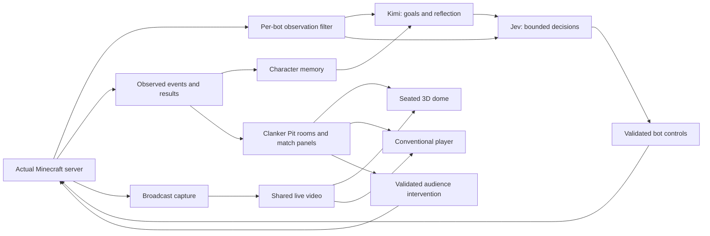

# Clanker Pit: decisions and staged plan

Updated September 20, 2026. This document records the conversation and proposes a build sequence. The current task is documentation only.

## 1. Product premise

Clanker Pit is a social spectator platform for AI competitions. Its first game is a small survival arena inside actual Minecraft. People watch characters make consequential decisions, develop relationships, and respond to setbacks, while sharing a room with other spectators.

The longer-term ambition is a world surrounding the competition: districts, residents with backgrounds and motives, a selection draw, a wealthy capital, sponsors, organizers, and an eventual revolution. Events outside the arena affect the contestants and the match; events inside it affect the wider world.

The immediate goal is a small, entertaining match with recognizable characters and a shared viewing experience.

## 2. What we have decided

| Topic | Recorded direction | Status |
| --- | --- | --- |
| Platform | Clanker Pit will eventually host more than one AI game. | Confirmed |
| First game | Bots play inside actual Minecraft. | Confirmed |
| Initial scope | Start simple and expand after the core experience works. | Confirmed |
| Human gathering place | The control room is a website. | Confirmed |
| Immersive viewing | Viewers sit in a 3D dome theater, rotate their view, and see other people. | Confirmed |
| Movement | Viewers remain seated; ordinary navigation does not involve walking around. | Confirmed |
| Seat and room changes | Users may select a different seat or another room. | Desired direction; exact behavior remains open |
| Conventional viewing | A theater mode shows an ordinary website video player outside the 3D environment. | Confirmed |
| AI models | Explore Kimi K3 through the user's RunPod access, combined with TypeSafe's Jev. | User-requested technical direction; integration untested |
| Character depth | Backgrounds, motives, memories, and reactions should help make bots interesting. | Confirmed creative direction |
| Larger world | Districts, selection draws, capital influence, airdrops, game control, and eventual revolution. | Long-term creative direction |
| Work now | Write plans and decisions without starting the build. | Confirmed scope |

Four contestants, Java Edition, Mineflayer, a closing border, a ten-minute target, and one audience-voted airdrop are **proposed starting defaults** from the discussion. They have not been individually approved as fixed requirements.

## 3. The spectator experience

### Dome mode

A visitor selects a match and joins a room. They occupy a fixed seat in a dome-shaped auditorium, facing a large screen. Looking left, right, up, or behind reveals the architecture and the other seated viewers.

Proposed first implementation:

- A simple seated avatar and display name for each viewer.
- Mouse or touch camera rotation around the seat; a clear recenter control.
- A seat picker that moves the viewer directly to an available seat with a short fade.
- A room picker for moving between social rooms watching the same match.
- Readable match information, room chat, and an intervention panel.
- One shared broadcast feed per match at first.

Seat position changes the view of the theater. It does not move the Minecraft broadcast camera. The server owns seat occupancy; simultaneous requests for a seat cannot produce two occupants.

The dome describes the social environment. Whether the video fills a curved front screen or the whole dome remains a visual design choice. The initial recommendation is a large front screen that preserves the video's proportions. A true panoramic Minecraft broadcast would be a separate feature.

### Theater mode: conventional player

One control switches to a normal video player with the same match, chat, contestant information, and intervention controls. This is a complete viewing option for smaller devices, lower graphics capacity, and people who prefer a flat interface.

Switching presentation modes should preserve match position, room membership, identity, and voting status. For the prototype, a viewer can keep their assigned seat while the 3D scene is hidden. A room change explicitly releases the old seat.

Start with ordinary text chat. Voice, spatial audio, elaborate avatars, and VR are future options rather than prerequisites.

### Shared timing and interaction

Both presentations consume the same broadcast and timestamped match events. A knockout shown on screen should agree with the contestant panel. Playback delay must be visible enough that intervention deadlines make sense.

Proposed audience rule: one shared airdrop for the entire match, with votes aggregated across its rooms. Moving seats, changing rooms, or switching modes does not grant another vote. The server closes voting and records the intervention once. Late viewers and viewers behind the live edge see the current deadline and result.

Initially, humans influence a bounded game mechanic. A host separately controls match start and emergency stop. Broader control-room powers can be added after the basic competition works.

## 4. Proposed first game: Season Zero

| Element | Proposed baseline |
| --- | --- |
| Contestants | Four distinct AI characters |
| Arena | One small, repeatable Minecraft map with cover and supply chests |
| Equipment | A small set of familiar weapons, food, and healing resources |
| Actions | Navigate, loot, equip, eat, attack, retreat, and take cover |
| Pressure | A closing border and a fixed maximum match duration |
| Result | Last survivor wins; simultaneous final deaths produce a draw; time expiry with multiple survivors produces a draw |
| Audience influence | One match-wide supply drop, selected by a timed vote |
| Target duration | Approximately 5–10 minutes, adjusted after observing real matches |
| Character introduction | Name, short origin, motive, disposition, and a relationship hook |

A short preparation period gives viewers time to meet the cast and bots time to gather supplies. The match then escalates toward a conclusion. Elimination prevents further contestant actions. Every match starts from a known map snapshot and records its result.

Districts can initially appear as background labels. A selection ceremony, district simulation, extensive crafting, autonomous construction, complex negotiations, and persistent seasons belong to later increments.

Creepers are a useful reference for meaningful setbacks, but adding them to the first competitive arena is optional. Start by proving that bots can navigate, make choices, and complete a match.

## 5. Kimi, Jev, and Minecraft controls

The working hypothesis is that the two models can serve different decision timescales. This is a design to evaluate, not a demonstrated performance claim.

| Layer | Proposed responsibility | Example |
| --- | --- | --- |
| Kimi K3 through RunPod | Character goals, social judgments, reflection after important events, short dialogue, and visual interpretation where the endpoint supports it | After a rescue, decide whether this character now trusts the rescuer |
| Jev | Small choices or assessments using the current goal and a compact observation | Choose between two reachable supply locations given risk tolerance and remembered danger |
| Bot controller | Execute movement, aim, attack timing, inventory actions, and immediate hazard responses | Follow a route, equip a weapon, or escape an imminent explosion |
| Minecraft server and match controller | Enforce physics, damage, allowed actions, match rules, and intervention limits | Decide whether an attack landed and whether the match has ended |

Jev's documented interface supports typed decisions. Kimi's RunPod integration and multimodal evidence are covered in [the research notes](RESEARCH.md). Character consistency, latency, and any improvement from combining them still need measurement.

Kimi establishes a current goal and constraints. Jev selects bounded actions consistent with that goal. A single controller validates and executes an action. Neither model directly changes health, fabricates an inventory item, or decides that an attempted action succeeded.

Urgent movement and survival responses run in code without waiting for a network model call. Initial scheduling hypotheses are event-driven Jev decisions and Kimi reflection at meaningful events or occasional checkpoints. Exact intervals come from latency and cost measurements.

Responses carry the observation revision they were based on. If the target disappears, the bot dies, or the situation changes, an outdated response is discarded. Requests have deadlines, per-bot concurrency limits, and a match budget. On timeout, the controller uses a bounded fallback and logs it; it must not silently present fallback behavior as a model decision.

### What makes a character memorable

Each character gets a stable identity, a motive, a few dispositions, relationships, and an application-managed memory record. Models receive relevant memories with the current observation; persistence does not require fine-tuning the model.

Separate three kinds of information:

- **Observed events:** what the character actually saw, heard, received, or experienced.
- **Beliefs:** what the character inferred, including uncertainty and possible mistakes.
- **Intentions:** what it currently wants to do and the constraints it has chosen.

An illustrative sequence: a contestant loses supplies near a rival, believes the rival lured them into danger, and later declines that rival's offer of help. Another contestant might instead seek the rival's protection. The consequences of the same event can depend on personality and history.

Memory entries should point back to observed events so a generated interpretation cannot silently rewrite match history. Beliefs may change when new evidence arrives. A bot stuck in repetitive behavior triggers a fresh assessment, rather than accumulating an irreversible fear score.

The spectator feed can show actions, selected memories, and deliberately generated in-character remarks. Raw provider reasoning is not required for the product. Dialogue expresses the character; match events establish what actually happened.

### Perception and multimodality

Start with each bot's own health, inventory, nearby perceptible entities, local terrain, and received messages. Build a deliberate visibility filter; information available through a bot library is not automatically information the character is allowed to know.

Kimi may receive occasional screenshots from that bot's viewpoint after the RunPod image path is verified. Short timestamped frame sequences or clips can be evaluated later if supported. Spectator cameras and private information about opponents must stay outside a contestant's input.

Structured observations remain useful for precise actions. Images may help with visual interpretation and character reactions. The first experiment should compare their contribution rather than assume continuous video will improve play.

## 6. System outline

Proposed Minecraft integration is Java Edition with Mineflayer and its navigation ecosystem. Pin a mutually compatible server, bot, and plugin version after a working connection and movement test. The exact version and hosting location remain open. [Mineflayer](https://github.com/PrismarineJS/mineflayer) documents movement, inventory, world access, and entity attacks; [mineflayer-pathfinder](https://github.com/PrismarineJS/mineflayer-pathfinder) provides navigation.

A bot connection does not itself produce a conventional video stream. Plan a separate spectator/rendering process and an encoder/broadcast path. Evaluate capture from an actual Minecraft spectator client against a compatible web renderer. Rendering quality, version support, hardware needs, and delay determine the choice. [Prismarine Viewer](https://github.com/PrismarineJS/prismarine-viewer) is a candidate to investigate, not a verified broadcast solution for this project.

The website can display the resulting video on a screen inside its 3D room and in its regular player. Room geometry and avatars render in the browser. Adding viewers or seats should share the broadcast rather than require a new Minecraft client per person.

Minecraft, bot workers, and capture need long-lived processes. The website and room service can be deployed separately. Hosting vendors, framework, database, and streaming transport will be chosen when the first technical tests provide enough evidence.

Keep the shared platform centered on matches, entrants, rooms, broadcasts, events, and bounded interventions. Minecraft supplies the first game-specific adapter. Avoid building a general game engine before a second game needs one.

## 7. Build sequence when implementation is requested

| Stage | Deliverable | Evidence required to move on |
| --- | --- | --- |
| 0. Provider and connection checks | Verify Kimi text, then image input; verify one Jev choice; connect one bot to a local Minecraft server | Actual successful responses with explicit model IDs, recorded latency and usage, and a bot that moves and uses inventory; separately record whether video is supported |
| 1. Character experiment | One bot responds to a few controlled encounters with identity and memory | An observed event affects a later decision; no hidden world information leaks into the observation; compare Kimi plus Jev against a simpler baseline |
| 2. Complete match | Four bots play a repeatable arena with elimination and a defined result | Multiple complete runs; valid movement and combat; reliable start, finish, reset, fallback handling, and event recording |
| 3. Shared viewing foundation | Actual match video, room presence, text chat, and the proposed airdrop vote in the conventional player | Two browser sessions see the same match and event timing; a vote produces one real intervention; refresh and reconnect recover current state |
| 4. Dome experience | Fixed seats, camera rotation, visible viewers, seat changes, a small room selector, and mode switching | Two users see one another; seat conflicts are resolved; mode changes preserve the session; lower-capability devices can use the flat player |
| 5. Character and world expansion | More relationships, a selection draw, sponsorship, persistent consequences, and later political mechanics | Viewers can recognize characters from behavior, and world changes have observable effects on subsequent play |

Stage 3 is an intermediate foundation. The first complete product prototype includes both viewing modes in stage 4.

Before paid experiments, choose a small explicit spending limit and record actual provider usage. Compare decision quality, character consistency, stalled actions, latency, and cost. A convincing written biography alone is not a successful character experiment.

## 8. The larger story

The long-term loop is: district life produces relationships and pressures; the draw selects contestants; sponsors and organizers influence the match; outcomes change wealth, reputation, and grievances; those consequences shape the next selection and eventually the revolution.

The user wants an eventual revolutionary arc. The degree of scripting remains unresolved. An authored season can introduce opportunities for rebellion while agents choose their tactics, allies, and timing. A fully emergent simulation might never produce the intended revolution. Choose deliberately between those approaches before implementing the political layer.

A rebellion needs actual game mechanics: communication, cooperation, organizer objectives that can be disrupted, and alternative outcomes. Declaring rebellion in dialogue alone does not change the world.

Human spectators may eventually take on sponsor or capital roles, while AI residents simulate other parts of that society. The division between human and AI control remains open.

## 9. Open choices and current boundaries

- Exact contestant count, arena rules, time limit, and first intervention.
- Dome screen shape and art direction; whether room changes affect only the social group or also the broadcast feed.
- How much character memory viewers see live, and whether some is revealed after a match.
- Whether character memories survive into later matches, and how that fits elimination and continuity.
- How much of the revolution is guaranteed by the season's authored story.
- RunPod image and video request support for this account and route, plus observed Kimi/Jev latency and cost.
- Minecraft version, bot authentication, server host, rendering method, and broadcast transport.

These questions do not block the current planning document. There is no implemented prototype or measured model performance yet. No keys have been requested or read, no inference has been run, and no hosting has been provisioned during this planning task.
